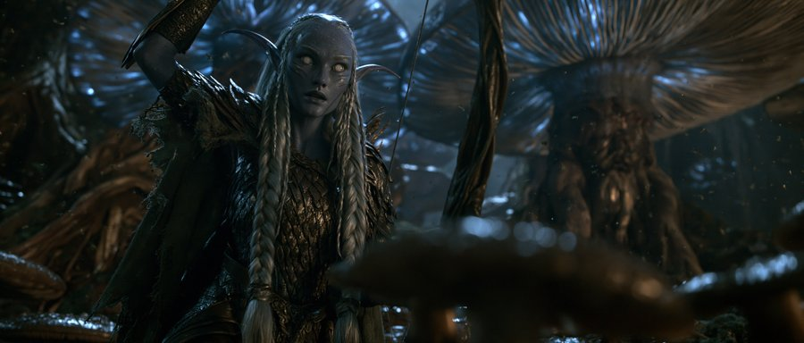
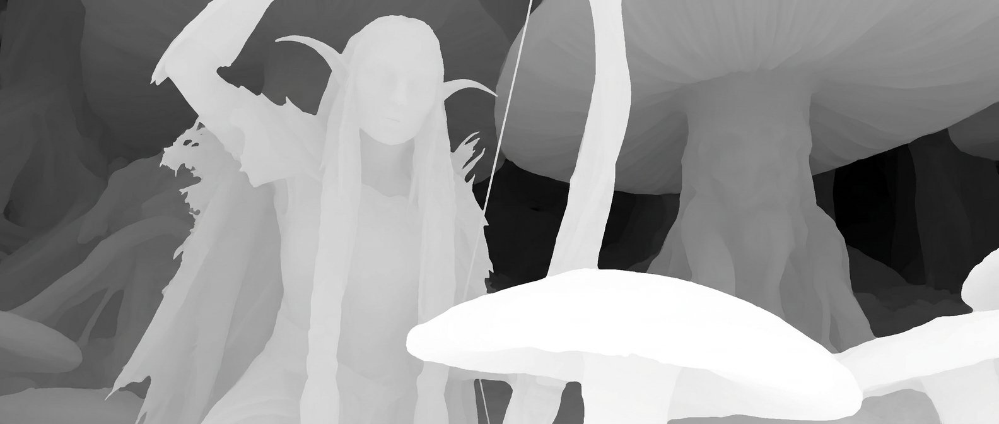
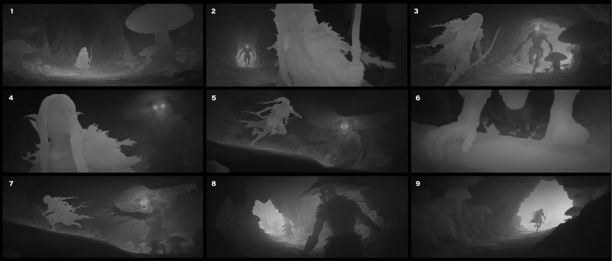
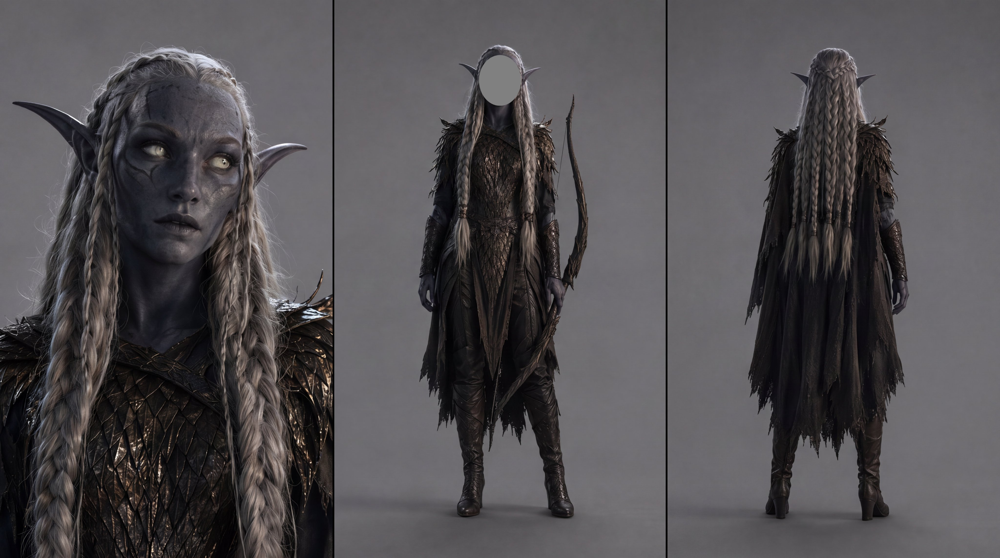
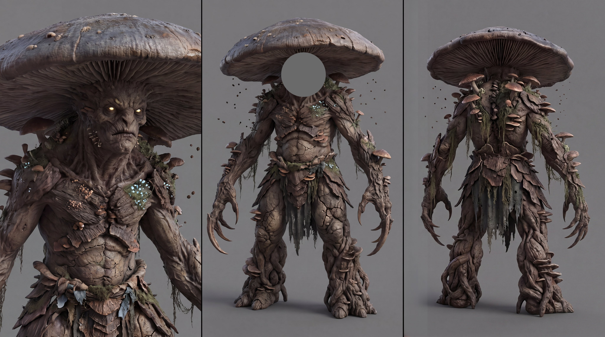

# Depth-First Cinematic Storyboarding — OAK Workflow

> Source: [@_OAK200 thread](https://x.com/_OAK200) · 19 Jul. 2026
> Images downloaded locally in `images/`

---

## The Idea

The storyboards everyone uses carry color, lighting, texture, and style.

A **depth-map storyboard** strips that away and keeps only:

- Camera placement
- Subject scale
- Foreground, midground, background
- Silhouettes
- Spatial relationships

---

## Step 1 — Start with your reference image

Start with the image you want to use as the tone and final look.



For this example, OAK used an image generated with Midjourney.

---

## Step 2 — Extract a depth map

Use Nano Banana or GPT Image 2 with this prompt:

```
Convert this image into a physically accurate grayscale linear depth map.
White = nearest, black = farthest.
Preserve geometry, silhouettes, and occlusion boundaries.
Use smooth surface depth gradients and crisp object edges.
Remove all color, texture, lighting, shading, outlines, normals, and ambient occlusion.
Output only the clean depth map.
```



---

## Step 3 — Generate the 3×3 depth storyboard

Upload both images (reference + depth map) to Nano Banana or GPT Image 2, then use the system prompt in [`storyboard-prompt.md`](storyboard-prompt.md).

This generates a 3×3 grid of 9 sequential depth-map shots from the same scene.



---

## Step 4 — Lock character identity with character sheets

After generating the storyboard, use character sheets to lock the appearance of your characters across every shot.

This preserves face, clothing, proportions, and key design details throughout the shots.





See: [`../../protocols/character-reference-sheet/`](../character-reference-sheet/) for the Character Reference Sheet v2.0 protocol.

---

## Step 5 — Generate the clips with Seedance 2.0

Use:
- The **original reference image** for the visual style
- The **depth-map storyboard** for its shot composition
- The **character sheets** for identity consistency

### The Golden Rule

> The **depth storyboard** controls the camera and composition.
> The **reference image** controls the look.
> The **character sheets** control identity.

---

*Hope this helps anyone experimenting with more controlled, composition-first AI filmmaking.* ❤️

— OAK